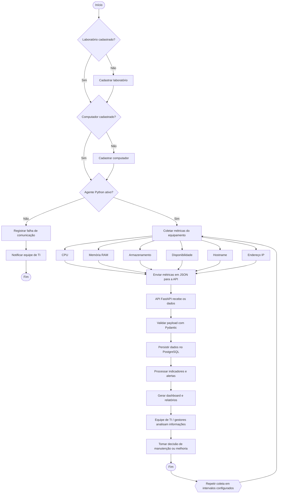

# BPMN do projeto EDU-Infra Analytics

Este arquivo apresenta um exemplo de diagrama BPMN para o processo de monitoramento e análise da infraestrutura tecnológica de ambientes educacionais.

## Diagrama BPMN (Mermaid)

## Explicação dos principais pontos

### 1. Início do processo
- O processo inicia quando o sistema é acionado para monitorar a infraestrutura.
- Nesse ponto, considera-se que a operação já foi planejada e que o ambiente educacional está pronto para monitoramento.

### 2. Laboratório cadastrado?
- Verifica se o laboratório que será monitorado já foi previamente cadastrado no sistema.
- Se não estiver cadastrado, o processo exige o registro do laboratório antes da coleta.

### 3. Computador cadastrado?
- Confere se cada equipamento foi registrado no sistema.
- Se não houver cadastro, o computador precisa ser incluído antes de receber monitoramento.

### 4. Agente Python ativo?
- Esta etapa avalia se o agente de coleta está rodando corretamente no computador.
- Caso esteja indisponível, o sistema registra a falha e segue para tratativas de suporte.

### 5. Coletar métricas do equipamento
- O agente coleta dados essenciais do equipamento, como:
  - uso de CPU
  - uso de memória RAM
  - espaço em disco
  - disponibilidade do computador
  - hostname
  - endereço IP
- Esses dados formam a base para diagnóstico e alerta.

### 6. Envio para API em JSON
- As informações são enviadas para a aplicação backend em formato JSON.
- Esse passo é crucial para padronizar a comunicação entre o agente e a API.

### 7. API FastAPI recebe os dados
- A API valida e interpreta os dados recebidos.
- A estrutura do projeto indica o uso de FastAPI e Pydantic, o que é adequado para APIs de monitoramento.

### 8. Persistência no PostgreSQL
- Os dados são armazenados em banco de dados para consulta histórica.
- Isso permite análise de tendências, registros de disponibilidade e evolução do desempenho.

### 9. Processamento de indicadores e alertas
- O sistema calcula indicadores de saúde da infraestrutura.
- Possíveis aspectos:
  - disponibilidade geral
  - uso de recursos
  - alertas por limiar de risco
  - cálculo do Índice de Infraestrutura Educacional (IIE)

### 10. Geração de dashboard e relatórios
- Os dados coletados são exibidos em dashboards para visualização rápida.
- Também podem ser transformados em relatórios executivos para gestores e equipe de TI.

### 11. Análise da equipe de TI e gestores
- Os responsáveis pela infraestrutura visualizam os indicadores e tomam decisões.
- Isso pode incluir manutenção preventiva, ajustes de hardware, upgrades ou reconfiguração de laboratórios.

### 12. Manutenção ou melhoria
- Com base nos relatórios e alertas, a instituição decide ações como:
  - atualização de equipamentos
  - substituição de computadores
  - otimização de rede
  - revisão de configurações de software

### 13. Fim do ciclo
- O ciclo se repete periodicamente para manter o monitoramento contínuo.
- A coleta recorrente ajuda a detectar riscos antes que impactem diretamente a instituição.

## Sugestões de melhorias no processo

1. Adicionar autenticação e autorização para a API
   - Garantir que dados sensíveis não sejam acessados sem permissão.

2. Implementar filas e processamento assíncrono
   - Melhorar a escalabilidade do sistema e evitar perda de mensagens.

3. Criar gatilhos de alerta automáticos
   - Exemplos: CPU acima de 90%, memória crítica, disco quase cheio.

4. Incluir backup e histórico de métricas
   - Permitir comparações por dia, semana e mês.

5. Adicionar monitoramento da comunicação entre agente e API
   - Detectar falhas em tempo real e registrar logs de erro.

6. Criar relatórios executivos mais completos
   - Mostrar indicadores focados em gestão e manutenção institucional.

7. Fazer o processo mais orientado a eventos
   - Em vez de depender apenas de coleta periódica, gerar alertas quando houver mudanças significativas.

## Observação
Este é um exemplo de BPMN conceitual e pode ser ajustado conforme o desenvolvimento real do projeto. O projeto atual apresenta base de frontend, backend e arquitetura planejada, mas ainda está em desenvolvimento, como mostra o README do repositório.

---

Se quiser, também posso criar uma segunda versão do diagrama em:
- BPMN XML
- imagem SVG
- versão mais detalhada com tarefas debackend/frontend
- versão acadêmica para apresentação final
